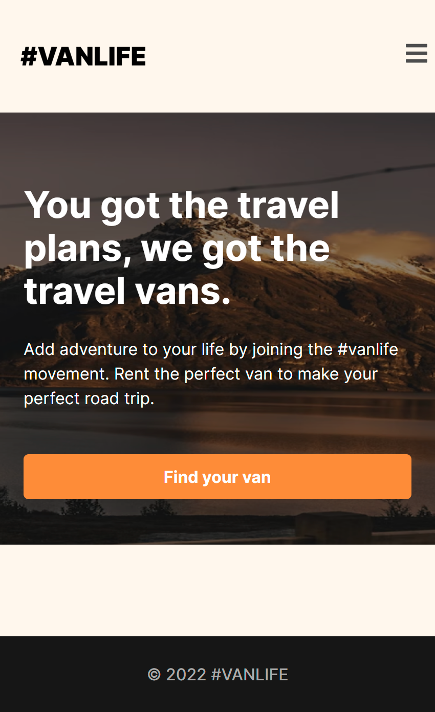
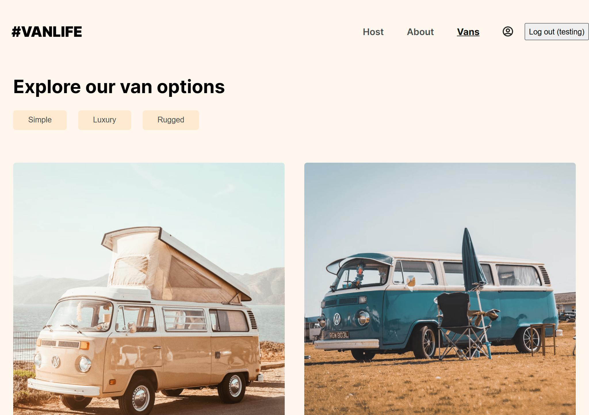
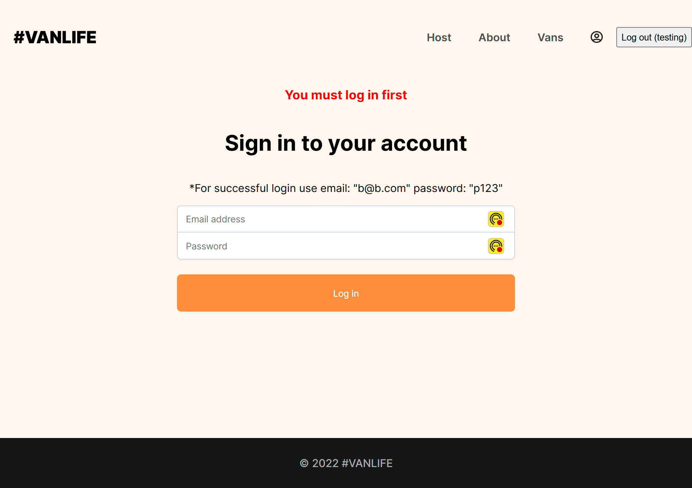
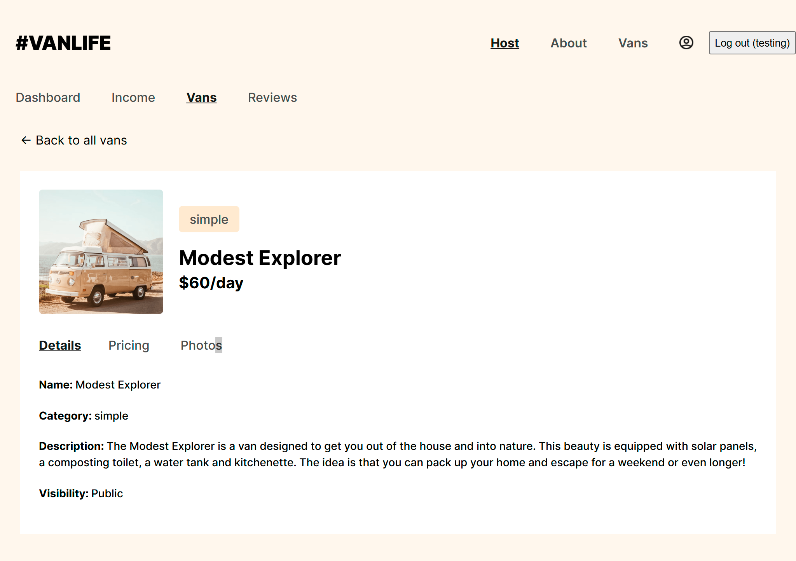

# Vans Rental Platform 🚐

Welcome to the Vans Rental Platform! This application is designed to connect van renters with hosts who list their vans for rental. It provides a seamless experience for both renters seeking adventure and hosts managing their listings.

## 🚀 Features

- **User-Friendly Van Rental Experience:** Renters can easily browse, view details, and book vans with a streamlined, intuitive interface.
- **Host Dashboard:** Hosts can log in to view their dashboard, manage listings, track income, and view reviews.
- **Secure Authentication:** A login system ensures that hosts can securely access and manage their accounts.
- **Real-Time Data with MirageJS:** MirageJS is used to simulate API calls, providing realistic data responses and a smooth development experience.
- **Responsive Design:** The platform is optimized for accessibility and usability across devices, ensuring a great experience on mobile, tablet, and desktop.
- **Error Handling:** A custom “Not Found” page directs users back to available routes if they navigate to an undefined page.

## 🛠️ Technologies Used

- **React:** For building reusable, dynamic components and creating an interactive UI.
- **React Router:** Handles client-side routing, including nested routes for easy navigation between sections.
- **MirageJS:** Mocks backend endpoints to simulate a real API environment during development.
- **CSS:** Styles the application, ensuring a responsive and clean layout.

## 📚 What I Learned

- **React Router:** Leveraging nested routes to organize sections of the app like van listings and host management pages.
- **API Simulation with MirageJS:** Using MirageJS to simulate API calls, creating a realistic development environment without needing a backend.
- **User Authentication Flow:** Implementing authenticated and unauthenticated routes to protect certain sections.
- **Responsive Layout Design:** Creating a design that adjusts smoothly across devices for a consistent user experience.

## 🔗 Links

- **GitHub Repository:** [https://github.com/claudiooleite/van-life](#)
- **GitHub Repository:** [https://van-life-project-claudio.netlify.app/](#)

## 🖼️ Screenshots

### 📱 Home Page (Mobile View)

### 🖥️ Home Page (Desktop View)

### 📱 Login Page

### 📅 Host Vans

